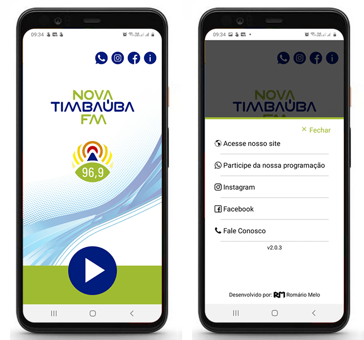

# Aplicativo da Rádio Nova Timbaúba FM

Esse aplicativo foi desenvolvido exclusivamente para dispositivos Mobile Android. Usando React Native. Consiste basicamente na transmissão de streaming de áudio da programação da Rádio Nova Timbaúba FM da Cidade de Timbaúba em Pernambuco ([Site](https://www.novatimbaubafm.com)).

## 📲 Distribuição

[Download Google Play](https://play.google.com/store/apps/details?id=com.novatimbaubafm.novatimbaubafm&hl=pt_BR&gl=US)

## 🚀 Tecnologias aplicadas

 

## 📱 Screenshots

